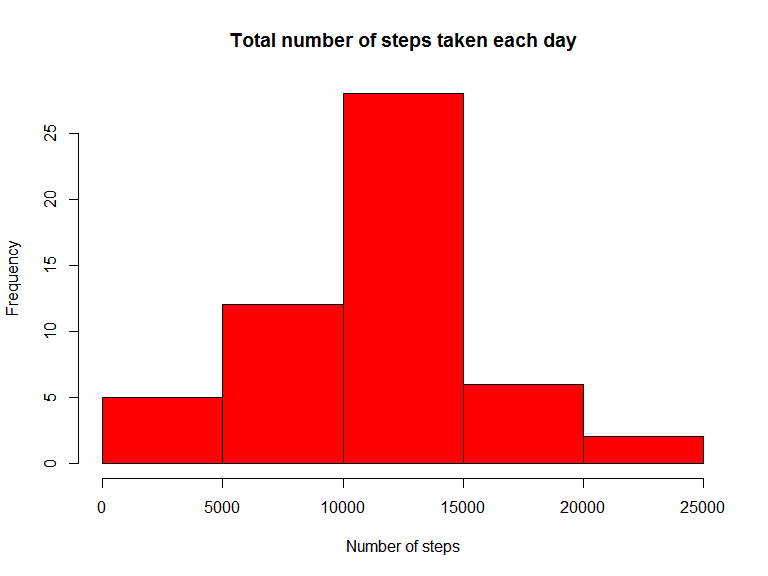
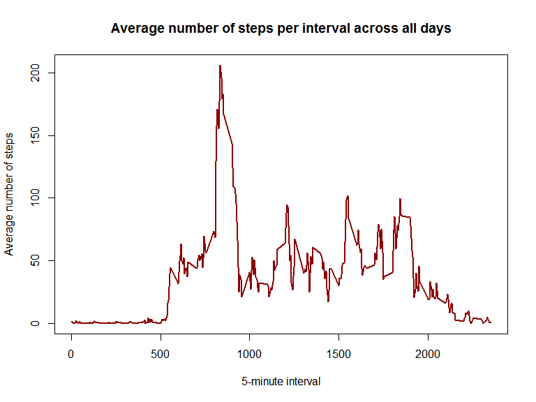
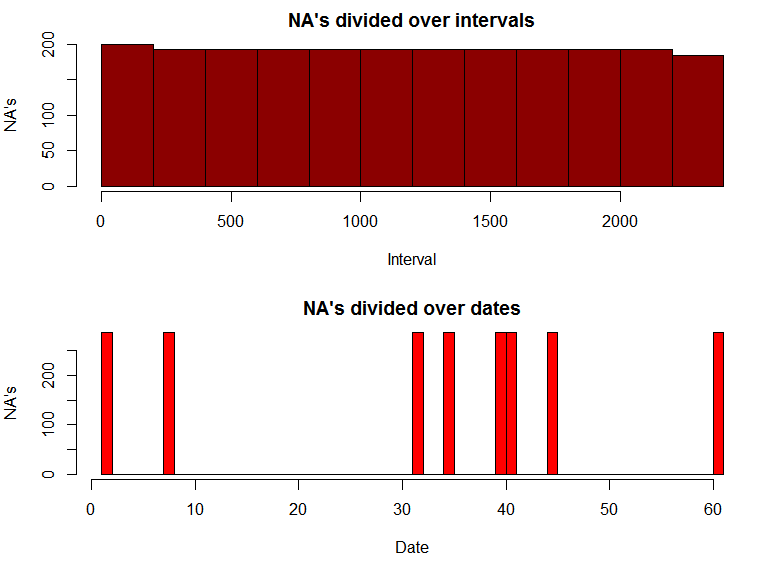
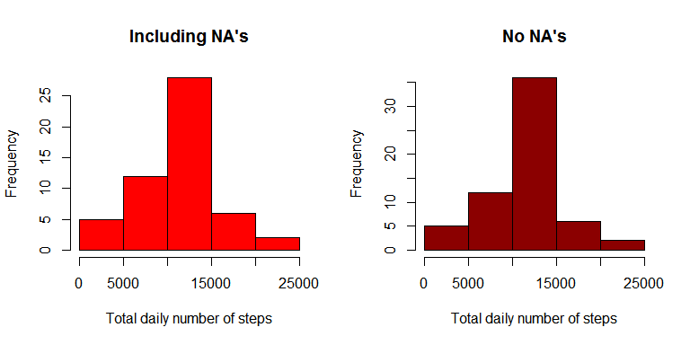
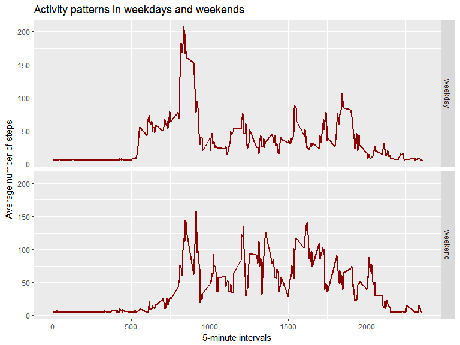

# Reproducible Research: Peer Assessment 1

## Project Introduction

This assignment makes use of data from a personal activity monitoring device. This device collects data at 5 minute intervals through out the day. The data consists of two months of data from an anonymous individual collected during the months of October and November, 2012 and include the number of steps taken in 5 minute intervals each day.


## Dataset Information

The dataset is about Activity monitoring data and is stored in a CSV-file (activity.csv).
There are  17,568 observations and 3 variables.

The variables are:

* steps: Number of steps taking in a 5-minute interval (missing values are coded as NA)

* date: The date on which the measurement was taken in YYYY-MM-DD format

* interval: Identifier for the 5-minute interval in which measurement was taken


### Loading and preprocessing the data

First I make some preparations: 

* clean the up workspace 

* load required packages

Then I load the data from the unzipped file.


```r
rm(list=ls())

library(ggplot2)
library(datasets)
library(Hmisc)
```

```
## Loading required package: lattice
```

```
## Loading required package: survival
```

```
## Loading required package: Formula
```

```
## 
## Attaching package: 'Hmisc'
```

```
## The following objects are masked from 'package:base':
## 
##     format.pval, round.POSIXt, trunc.POSIXt, units
```

```r
# Read the unzipped file:
activity <- read.csv("activity.csv")
```


####Quick Research


```r
str(activity)
```

```
## 'data.frame':	17568 obs. of  3 variables:
##  $ steps   : int  NA NA NA NA NA NA NA NA NA NA ...
##  $ date    : Factor w/ 61 levels "2012-10-01","2012-10-02",..: 1 1 1 1 1 1 1 1 1 1 ...
##  $ interval: int  0 5 10 15 20 25 30 35 40 45 ...
```


```r
summary(activity)
```

```
##      steps                date          interval     
##  Min.   :  0.00   2012-10-01:  288   Min.   :   0.0  
##  1st Qu.:  0.00   2012-10-02:  288   1st Qu.: 588.8  
##  Median :  0.00   2012-10-03:  288   Median :1177.5  
##  Mean   : 37.38   2012-10-04:  288   Mean   :1177.5  
##  3rd Qu.: 12.00   2012-10-05:  288   3rd Qu.:1766.2  
##  Max.   :806.00   2012-10-06:  288   Max.   :2355.0  
##  NA's   :2304     (Other)   :15840
```

### What is mean total number of steps taken per day?

1. Total number of steps taken per day


```r
stepsTotal <- aggregate(steps ~ date, activity, sum)
```

2. Histogram total number of steps taken each day

```r
hist(stepsTotal$steps, xlab = "Number of steps", main = "Total number of steps taken each day", col = "red")
```

<!-- -->

3. Mean and median total number of steps taken each day

```r
meanSteps <- mean(stepsTotal$steps)
medianSteps <- median(stepsTotal$steps)
```


```r
meanSteps
```

```
## [1] 10766.19
```

```r
medianSteps
```

```
## [1] 10765
```

### What is the average daily activity pattern?

Aggregate function for the mean of the steps for each interval


```r
AggDailySteps <- aggregate(steps ~ interval, data = activity, FUN = mean, na.rm = TRUE)
```

1. Time series plot of the average number of steps taken

```r
plot(AggDailySteps$interval, AggDailySteps$steps, type = "l", col = "dark red", lwd = 2, 
     xlab = "5-minute interval", ylab ="Average number of steps",
     main = "Average number of steps per interval across all days")
```

<!-- -->

2. The 5-minute interval that, on average, contains the maximum number of steps


```r
# The maximum number of steps
maxDailySteps <- max(AggDailySteps$steps)

# The 5-minute interval that contains this maximum
maxInterval <- AggDailySteps$interval[which(AggDailySteps$steps == maxDailySteps)]

# rounds maximum number of steps to a number of 2 decimals 
maxDailySteps <- round(maxDailySteps, digits = 2)
```

* **The maximum number of steps:** 206.17

* **The 5-minute interval that contains this maximum:** 835


### Imputing missing values

1. The total number of missing values (NA's) in the dataset 


```r
sum(is.na(activity))
```

```
## [1] 2304
```

2. Devise a strategy for filling in all of the missing values in the dataset. 

If we look carefully at the *Quick Research* from above, the summary of activity tells us the following:

- the total number of NA's are indeed 2304 

- the NA's are all in the **steps** column 

We try to find out where the missing values appear.
So we start by subsetting the missing values from the original activity dataset.


```r
missingSteps <- subset(activity, is.na(steps))
```

Next we look at how these NA's are divided over the interval and date columns.


```r
# create 2 plots (columnwise):
par(mfcol = c(2, 1), mar = c(5, 4, 2, 1)) 

# NA's divided over interval column
hist(missingSteps$interval, xlab="Interval", ylab="NA's", main="NA's divided over intervals",col = "dark red")
# NA's divided over date column
hist(as.numeric(missingSteps$date), xlab="Date", ylab="NA's", main="NA's divided over dates", breaks = 61, col = "red")
```

<!-- -->

- The first plot tells us that the NA's are spread equally over the intervals. 

- The second plot tells us that there are 8 days in which the NA's occur.

Strategy: we fill the missing values in **steps** with the mean for that day.

3. Create new dataset equal to the original dataset but with the missing data filled in.


```r
activityImputed <- activity
activityImputed$steps <- impute(activity$steps, fun=mean)
```

4. Make a histogram of the total number of steps taken each day. 
We compare the histogram with the missing values from the first part of the assignment to a new histogram in which the missing values are imputed. 


```r
par(mfrow = c(1,2))

# Same earlier histogram: total number of steps taken each day
# stepsTotal <- aggregate(steps ~ date, activity, sum) # is already loaded
hist(stepsTotal$steps, xlab = "Total daily number of steps", main = "Including NA's", col = "red")

# Compared to the next histogram: total number of steps taken each day (missing values are imputed)
stepsImputedTotal <- aggregate(steps ~ date, activityImputed, sum)
hist(stepsImputedTotal$steps, xlab = "Total daily number of steps", main = "No NA's", col = "dark red")
```

<!-- -->

The comparison tells us that the values do differ from the estimates from the first part of the assignment.

The **mean** and **median** total number of steps taken per day.


```r
# Mean and median total number of steps taken per day (missing values are imputed)
meanStepsImp <- mean(stepsImputedTotal$steps)
medianStepsImp <- median(stepsImputedTotal$steps)
```


```r
meanStepsImp
```

```
## [1] 10766.19
```

```r
medianStepsImp
```

```
## [1] 10766.19
```

The impact of imputing missing data is as follows:

* The structure of the histograms is similar.

* The histogram with imputed NA's shows higher frequencies

* The value of the mean remained the same: **10766.19**

* The value of the median has increased from **10765** to **10766.19**


### Are there differences in activity patterns between weekdays and weekends?

1. Create a new factor variable in the dataset with two levels -- "weekday" and "weekend" indicating whether a given date is a weekday or weekend day.


```r
# Create character variable dayType in the dataset with levels "weekday" and "weekend".
activityImputed$dayType <- ifelse(weekdays(as.Date(activityImputed$date)) == "zaterdag" | weekdays(as.Date(activityImputed$date)) == "zondag", "weekend", "weekday") 
# Turn character variable into factor variable
activityImputed$dayType <- factor(activityImputed$dayType)
```

2. Panel plot comparing the average number of steps taken per 5-minute interval across weekdays and weekends

First we create a table containing the average number of steps taken per 5-minute interval across weekdays and weekends.


```r
meanStepsInterval <- aggregate(steps ~ interval + dayType, activityImputed, FUN = mean)
# Change name column "steps" into "meanSteps"
names(meanStepsInterval) <- c("interval", "dayType", "meanSteps")
```

Panel plot


```r
plot <- ggplot(meanStepsInterval, aes(interval, meanSteps))
plot + geom_line(color = "dark red", lwd = 1) + facet_grid(dayType~.) + labs(x = "5-minute intervals", y = "Average number of steps", title = "Activity patterns in weekdays and weekends") 
```

<!-- -->

Differences in activity patterns: 

* The start during weekdays is earlier (around 6am) 

* There is a peak in the weekdays (around 8am and 9am) 

* In weekends, the activity is more spread between 8am and 8pm.
